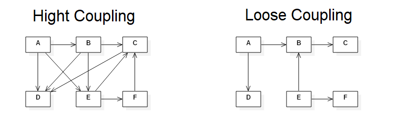
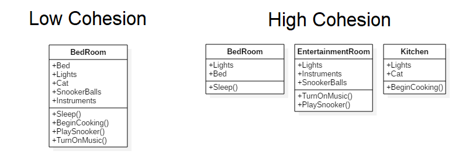
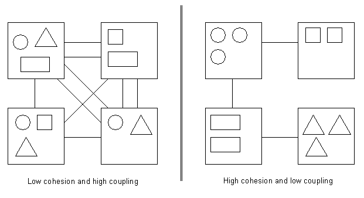

@title[Cover]

@snap[north-west byline]
  Software Development Series
@snapend

@snap[west headline text-white]
  @size[0.75em](@color[orange](SOLID) design principles)
@snapend

---

@title[What's SOLID ?]

### SOLID design principles

@size[0.6em](In object-oriented computer programming, the term SOLID is a mnemonic acronym for five design principles intended to make software designs more @color[yellow](understandable, flexible and maintainable). These principles were first published by @color[yellow](Robert C. Martin), popularly known as @color[yellow](Uncle Bob). He is also a coauthor of the @color[yellow](Agile Manifesto).)

---

@title[Coupling]

## Coupling
@size[0.75em](The degree to which a class, method or any other software entity, is directly linked to another. This degree of coupling can also be seen as a degree of dependence.)

---

@title[Cohesion]

## Cohesion
@size[0.75em](Cohesion refers to the degree to which the elements inside a module belong together. It is a measure of the strength of relationship between the methods and data of a class and some unifying purpose or concept served by that class.)

---

@title[Coupling & Cohesion]

## Coupling & Cohesion

@size[0.75em](To obtain a good software we must always try to have a @color[yellow](low coupling) and a @color[yellow](high cohesion), and SOLID principles help us with this task. If we follow these guidelines our code will be more robust, maintainable, reusable and extensible and we will avoid the tendency of our code to break in many places every time something is changed.)

+++

@title[Good software]

---

@title[S.O.L.I.D]

@snap[midpoint list-content-concise span-100]
@size[1.5em](@color[orange](**S.O.L.I.D**))  
stands for five primary class design principles
@ol 
 
- @color[orange](**S**)ingle Responsibility Principle (SRP)
- @color[orange](**O**)pen Closed Principle (OCP)
- @color[orange](**L**)iskov Substitution Principle (LSP)
- @color[orange](**I**)nterface Segregation Principle (ISP)
- @color[orange](**D**)ependency Inversion Principle (DIP)
@olend
@snapend